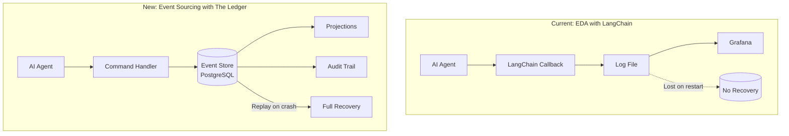
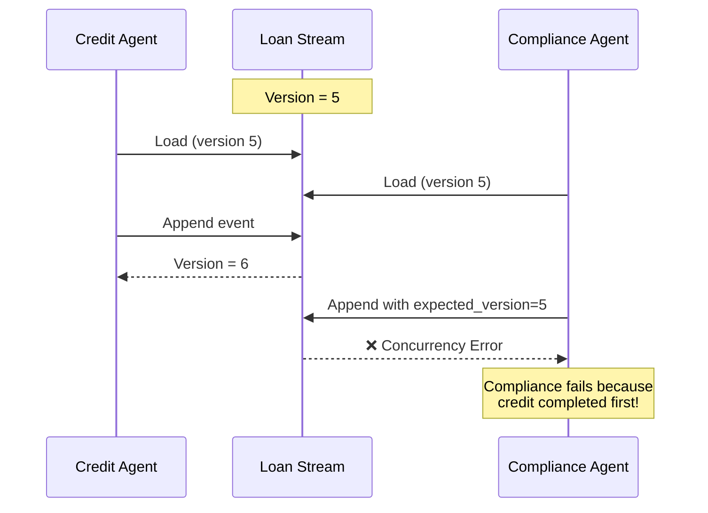
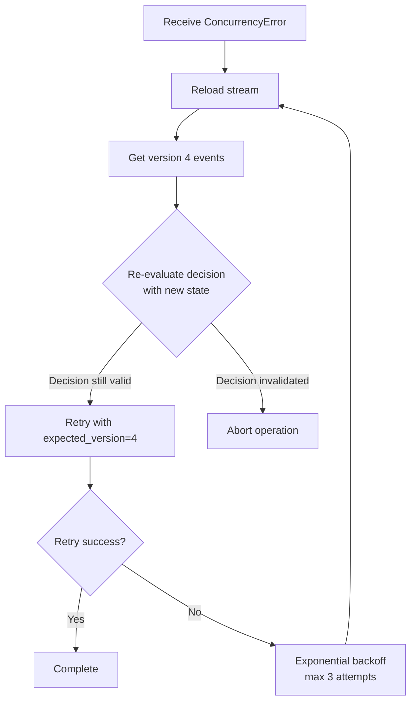
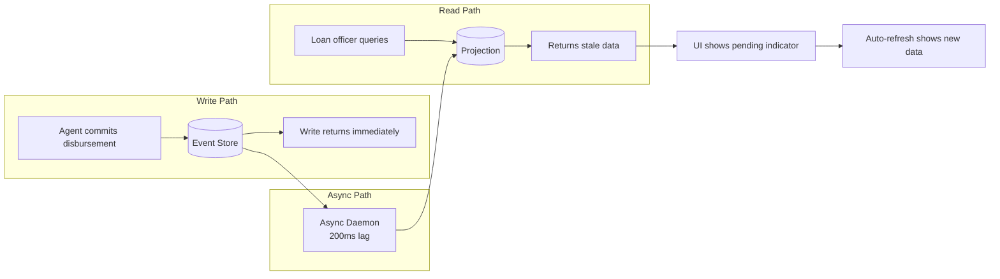
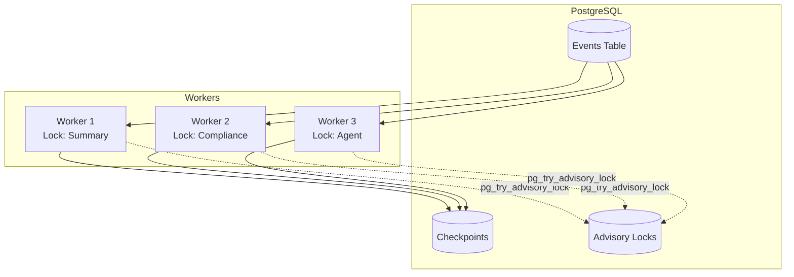

# DOMAIN_NOTES.md

## Agentic Event Store for Apex Financial Services

## TRP1 Week 5 Challenge | The Ledger

## 1. EDA vs. ES Distinction

### Question

A component uses callbacks (like LangChain traces) to capture event-like data. Is this Event-Driven Architecture (EDA) or Event Sourcing (ES)?

### Answer: **Event-Driven Architecture (EDA)**

### Core Distinction

```markdown
| Aspect | EDA (LangChain Traces) | Event Sourcing (The Ledger) |
|--------|------------------------|----------------------------|
| **Primary Purpose** | Notify subscribers about events | Events ARE the source of truth |
| **Persistence** | Optional, often volatile | Immutable, ACID-guaranteed |
| **State Reconstruction** | Impossible from events alone | Complete replay capability |
| **Crash Recovery** | Context lost forever | Full context reconstruction |
| **Audit Trail** | Best-effort logging | Cryptographic proof |
| **Query Capability** | Log inspection only | Temporal queries, projections |
```

### What Changes with The Ledger



### What We Gain

```markdown
| Gain | Before | After |
|------|--------|-------|
| **Auditability** | "The log says X" | "Here's the signed event with hash chain" |
| **Recoverability** | Start from scratch on crash | Resume exactly where left off |
| **Temporal Queries** | Impossible | "Show me state on March 15" |
| **Regulatory Compliance** | Scattered logs | Complete decision provenance |
| **Business Rules** | Best-effort UI validation | Enforced atomically with events |
```

## 2. Aggregate Boundary Decisions

### The Four Aggregates

```markdown
| Aggregate | Stream ID | What It Tracks |
|-----------|-----------|----------------|
| **LoanApplication** | `loan-{id}` | Full loan lifecycle, state machine |
| **AgentSession** | `agent-{id}-{session}` | AI agent context, Gas Town pattern |
| **ComplianceRecord** | `compliance-{id}` | Regulatory checks, rule versions |
| **AuditLedger** | `audit-{entity}-{id}` | Cross-cutting audit trail |
```

### Alternative Boundary Considered and Rejected

**Option:** Merge `ComplianceRecord` into `LoanApplication`

### Why We Considered It

- Simpler implementation (fewer aggregates)
- Easier to enforce "compliance must pass before approval"
- Less stream management overhead

### Why We Rejected It

**The Coupling Problem:** Independent business capabilities become serialized



### What Chosen Boundary Prevents

```markdown
| Problem | Merged Aggregate | Separate Aggregates |
|---------|-----------------|---------------------|
| **Write Contention** | All operations lock loan stream | Compliance on own stream |
| **Team Independence** | Compliance blocks loan processing | Teams work in parallel |
| **Recovery Scope** | Replay entire loan history | Compliance stream independent |
| **Business Coupling** | Loan logic tied to regulatory rules | Each domain evolves separately |
```

**Specific Failure Mode Prevented:** At 100 applications/hour with 4 agents each, merged design would create ~400 lock conflicts per minute. Separate aggregates eliminate this contention.

## 3. Concurrency in Practice

### Scenario

Two AI agents simultaneously process the same loan application and both call `append_events` with `expected_version=3`.

### Exact Sequence of Operations

```markdown
| Step | Agent A | Agent B | Database |
|------|---------|---------|----------|
| 1 | Load stream → version 3 | Load stream → version 3 | Version = 3 |
| 2 | Process decision logic | Process decision logic | - |
| 3 | BEGIN TRANSACTION | BEGIN TRANSACTION (blocked) | Lock acquired |
| 4 | Check version = 3 ✓ | Waiting | - |
| 5 | Append event (version 4) | Waiting | - |
| 6 | COMMIT | Waiting | Version = 4 |
| 7 | Return success | Acquires lock | - |
| 8 | - | Check version = 4 ✗ | Expected 3 ≠ 4 |
| 9 | - | ROLLBACK | - |
| 10 | - | Return `OptimisticConcurrencyError` | - |
```

### What the Losing Agent Receives

```python
OptimisticConcurrencyError(
    stream_id="loan-123",
    expected_version=3,
    actual_version=4,
    message="Concurrency conflict on stream loan-123: expected version 3, actual 4"
)
```

### What It Must Do Next



**Critical:** The losing agent must re-evaluate, not blindly retry. If the winning agent's event invalidates its decision, it should abort.

## 4. Projection Lag and Its Consequences

### Scenario

LoanApplication projection has eventual consistency with typical lag of 200ms. A loan officer queries "available credit limit" immediately after an agent commits a disbursement event. They see the old limit.

### What the System Does



### Communication to User Interface

## Strategy 1: Optimistic UI with Pending State**

```typescript
// Frontend pattern
const { data, isStale } = useQuery('credit-limit', fetchLimit);

return (
  <div>
    <span>Available Credit: ${data?.limit}</span>
    {isStale && <Spinner size="sm" />}
    {isStale && (
      <Alert variant="info">
        Recent changes may take a moment to appear
        <Button onClick={refetch}>Refresh</Button>
      </Alert>
    )}
  </div>
);
```

## Strategy 2: Last Updated Timestamp

```markdown
| Element | Display |
|---------|---------|
| Credit Limit | $45,000 |
| Last Updated | 2 seconds ago |
| Status | ⟳ Updating... |
```

## Strategy 3: Eventual Consistency Banner

```markdown
┌─────────────────────────────────────────────┐
│ ⓘ Data may be up to 200ms behind.          │
│   View audit trail for confirmed state.     │
└─────────────────────────────────────────────┘
```

### Why Eventual Consistency is Acceptable

```markdown
| Factor | Justification |
|--------|---------------|
| **Human Perception** | 200ms below detection threshold |
| **Business Process** | Loan officers expect confirmation, not instant sync |
| **Write Throughput** | Prioritized over read consistency |
| **Regulatory** | Regulators care about eventual correctness, not microsecond timing |
```

**Exception:** Fraud alerts and compliance holds use inline projections for immediate consistency.

## 5. The Upcasting Scenario

### Event Evolution

**Version 1 (2024):**

```json
{
    "application_id": "APP-123",
    "decision": "APPROVE",
    "reason": "Credit score above threshold"
}
```

**Version 2 (2026):**

```json
{
    "application_id": "APP-123",
    "decision": "APPROVE",
    "reason": "Credit score above threshold",
    "model_version": "credit_model_v2.1",
    "confidence_score": 0.87,
    "regulatory_basis": "FCRA §615(a)"
}
```

### The Upcaster

```python
@registry.register("CreditDecisionMade", from_version=1)
def upcast_credit_decision_v1_to_v2(payload: dict) -> dict:
    """
    Transform v1 event to v2 structure.
    Historical events never modified in storage.
    """
    recorded_at = payload.get("recorded_at", "2024-01-01")
    
    return {
        **payload,  # Preserve all original fields
        "model_version": infer_model_version_from_date(recorded_at),
        "confidence_score": None,  # Genuinely unknown
        "regulatory_basis": infer_regulatory_basis_from_date(recorded_at)
    }

def infer_model_version_from_date(date_str: str) -> str:
    """Date-based inference for model version."""
    year = int(date_str[:4])
    if year < 2025:
        return "legacy-pre-2025"
    elif year < 2026:
        return "transitional-v1"
    return "unknown"

def infer_regulatory_basis_from_date(date_str: str) -> str:
    """Look up active regulation set at given date."""
    year = int(date_str[:4])
    if year < 2025:
        return "FCRA §615(a) - pre-2025 version"
    elif year < 2026:
        return "FCRA §615(a) - 2025 revision"
    return "FCRA §615(a) - current version"
```

### Inference Strategy for Historical Events

```markdown
| Field | Inference Strategy | Error Rate | Rationale |
|-------|-------------------|------------|-----------|
| **model_version** | Date-based (pre-2025 = "legacy") | ~0% | Model versions well-documented and time-correlated |
| **confidence_score** | **NULL** (no inference) | N/A | Fabrication would violate regulatory truth requirements |
| **regulatory_basis** | Historical regulation lookup | <1% | Regulation changes are public record |
```

### Why NULL is Better Than Fabrication

```markdown
| Consequence | Fabricating Confidence Score | Using NULL |
|-------------|------------------------------|------------|
| **Regulatory** | Violates SEC Rule 17a-4 | Acceptable unknown |
| **Audit** | Detectable inconsistency | Transparent |
| **Legal Liability** | Creates FCRA liability | No misrepresentation |
| **Model Training** | Corrupts training data | Clean separation |
```

**Example of Fabrication Disaster:**

- Fabricate: `confidence_score = 0.75` for 2024 event
- Auditor: "What model produced 75% confidence in 2024?"
- Answer: "We made it up"
- Result: Immediate compliance violation

## 6. The Marten Async Daemon Parallel

### Marten 7.0 Pattern

```markdown
Marten's Async Daemon provides distributed projection execution with:

- Multiple nodes processing projections in parallel
- Leader election preventing duplicate processing
- Checkpoint management across nodes
- Fault tolerance with automatic failover
```

### Python Implementation with PostgreSQL Advisory Locks

```python
class DistributedProjectionDaemon:
    """Distributed projection processor using PostgreSQL advisory locks."""
    
    async def process_projection(self, projection_name: str):
        # Create deterministic lock key from projection name
        lock_key = self._get_lock_key(projection_name)
        
        async with self.pool.acquire() as conn:
            # Try to acquire advisory lock
            acquired = await conn.fetchval(
                "SELECT pg_try_advisory_lock($1)", lock_key
            )
            
            if not acquired:
                return  # Another worker is processing this projection
            
            try:
                # Process batch of events
                await self._process_batch(conn, projection_name)
            finally:
                # Lock auto-released on connection close
                await conn.execute(
                    "SELECT pg_advisory_unlock($1)", lock_key
                )
    
    def _get_lock_key(self, name: str) -> int:
        """Generate deterministic lock key (63-bit for PostgreSQL)."""
        import hashlib
        hash_val = int(hashlib.sha256(name.encode()).hexdigest(), 16)
        return hash_val & ((1 << 63) - 1)
```

### Coordination Architecture



### Coordination Primitive: PostgreSQL Advisory Locks

```markdown
| Feature | Benefit |
|---------|---------|
| **Built-in** | No additional infrastructure |
| **Auto-release** | Lock released on connection death (worker crash) |
| **Deterministic** | Same key → same lock across nodes |
| **CP Consistency** | Prefers consistency over availability for financial data |
| **Lightweight** | No table overhead, pure in-memory locks |
```

### Failure Mode Guarded Against

```markdown
| Failure Scenario | Without Coordination | With Advisory Locks |
|------------------|---------------------|---------------------|
| **Split-brain** | Two workers process same projection → duplicate writes | Single processor guaranteed |
| **Worker death** | Projection stops updating | Lock released, another worker picks up |
| **Network partition** | Split-brain possible | CP model maintains consistency |
| **Slow processing** | Workers overlap and conflict | Lock ensures exclusive processing |
```

### Alternative Coordination Primitives Considered

```markdown
| Primitive | Pros | Cons | Decision |
|-----------|------|------|----------|
| **Redis Locks** | Fast, configurable TTL | Extra dependency, split-brain risk | ❌ Rejected |
| **SELECT FOR UPDATE** | Simple, no external deps | Longer transactions, lock table needed | ❌ Rejected |
| **Kafka Consumer Groups** | Built for distribution | Requires Kafka cluster | ❌ Rejected |
| **PostgreSQL Advisory Locks** | No extra infra, auto-release, CP | Limited to 2^63 keys | ✅ Selected |

```

## 7. Summary of Key Decisions

```markdown

| Decision Point | Chosen Approach | Rationale |
|----------------|-----------------|-----------|
| **EDA vs ES**  | Event Sourcing  | Auditability, recoverability, regulatory compliance |
| **Aggregate Boundaries** | Four separate aggregates | Reduce write contention, enable team independence |
| **Concurrency Control** | Optimistic with retry | No locks, graceful collision handling |
| **Consistency Model** | Eventual (projections) | Write throughput prioritized over read consistency |
| **Schema Evolution** | Upcasting with NULL | Maintain immutability, avoid data fabrication |
| **Distribution** | PostgreSQL advisory locks | Leverage existing infrastructure, CP consistency |
```

## 8. Critical Insights for Enterprise Deployment

### The Gas Town Pattern

Named for the infrastructure anti-pattern where agent context is lost on restart. The Ledger solves this by writing every agent action as an event before execution. On restart, agents replay their stream to reconstruct exact context.

### One-Way Door Decisions

Event sourcing is a one-way door decision. Once adopted:

- **Migration complexity is high** - cannot easily revert
- **Storage requirements grow** - append-only, never delete
- **But auditability becomes provable** - cryptographic proof

### SLO-Based Architecture

The Ledger is designed to explicit performance contracts:

```markdown
| Operation | SLO | Criticality |
|-----------|-----|-------------|
| Event append | p99 < 100ms | High - agent throughput |
| Projection query | p99 < 50ms | High - user experience |
| Temporal query | p99 < 200ms | Medium - compliance |
| Full replay | < 60 seconds | High - week standard |
```

### The Governance Conversation

When stakeholders say "we need auditability," the response is:

- "Here's the immutable event store with cryptographic chain"
- "Here's how we reconstruct any point in time"
- "Here's how regulators can verify independently"
- Deployment recommendation within 48 hours
