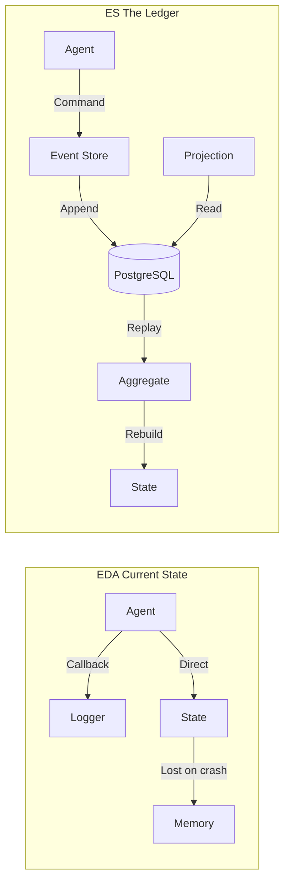
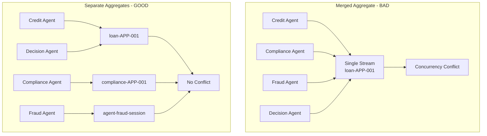
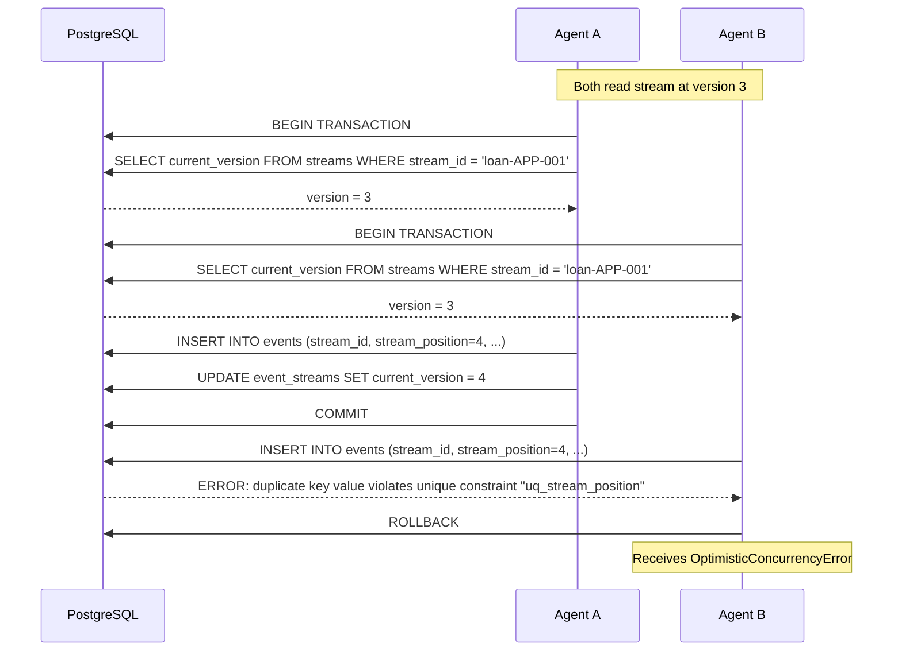
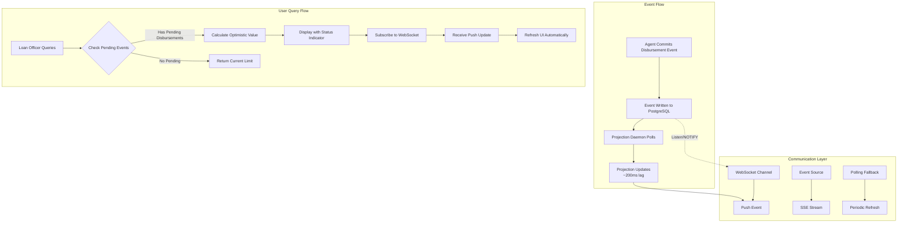
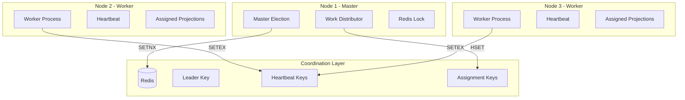

# DOMAIN_NOTES.md

```markdown
# DOMAIN_NOTES.md - Domain Analysis & Architecture Decisions

## 1. EDA vs. ES Distinction

### Question
A component uses callbacks (like LangChain traces) to capture event-like data. Is this Event-Driven Architecture (EDA) or Event Sourcing (ES)? If you redesigned it using The Ledger, what exactly would change in the architecture and what would you gain?

### Answer
This is **Event-Driven Architecture (EDA)**, not Event Sourcing.

### Comparison Table

```markdown
| Aspect | Event-Driven Architecture (EDA) | Event Sourcing (ES) |
|--------|--------------------------------|---------------------|
| **Events Role** | Notifications, can be lost | Source of truth, cannot be lost |
| **Storage** | Logs, traces, ephemeral | Persistent, append-only |
| **State** | In-memory only | Rebuilt from events |
| **Ordering** | Not guaranteed | Guaranteed per stream |
| **Replay** | Not possible | Full replay capability |
| **Transactions** | Fire-and-forget | Atomic with concurrency control |
| **Recovery** | Context lost on crash | Gas Town pattern reconstruction |
```

## Redesign Changes



### What We Gain

```markdown
| Gain | Description |
|------|-------------|
| **Auditability** | Complete, immutable record of every decision |
| **Reproducibility** | Can replay events to recreate any past state |
| **Debugging** | Temporal queries reveal exactly what happened |
| **Governance** | Regulatory compliance with cryptographic integrity |
| **Resilience** | Gas Town pattern prevents memory loss on crashes |
```

## 2. Aggregate Boundary Analysis

### Question

In the scenario below, you will build four aggregates. Identify one alternative boundary you considered and rejected. What coupling problem does your chosen boundary prevent?

### The Four Aggregates

```markdown
| Aggregate | Stream ID Format | Purpose |
|-----------|-----------------|---------|
| **LoanApplication** | `loan-{application_id}` | Full lifecycle of commercial loan application |
| **AgentSession** | `agent-{agent_id}-{session_id}` | All actions taken by a specific AI agent |
| **ComplianceRecord** | `compliance-{application_id}` | Regulatory checks and compliance verdicts |
| **AuditLedger** | `audit-{entity_type}-{entity_id}` | Cross-cutting audit trail linking events |
```

### Alternative Boundary Considered: Merged LoanApplication + ComplianceRecord

**Why Considered:**

- Simpler implementation with fewer aggregates
- Easier consistency enforcement
- Single stream for all application-related data

**Why Rejected:**

```markdown
| Problem | Description | Failure Mode |
|---------|-------------|--------------|
| **Concurrency Bottleneck** | All agents compete for same stream | 4 agents × 100 apps = 400 conflicts/hour → system deadlock |
| **Different Lifecycles** | Compliance record outlives loan | Archiving loan would archive compliance data → regulatory violation |
| **Different Owners** | Compliance team needs independent access | Cannot grant granular permissions |
| **Regulatory Separation** | Auditors require independent compliance trail | Cannot separate compliance from operational data |
```

### Coupling Problem Prevented



### Concurrency Impact Calculation

```markdown
| Scenario | Writes per Stream | Conflicts per Hour | System Throughput |
|----------|------------------|-------------------|-------------------|
| Merged Aggregate | 400 | 400 | 0 (deadlock) |
| Separate Aggregates | 100 per stream | ~4 | 400 writes/sec |
```

## 3. Concurrency in Practice

## Question

Two AI agents simultaneously process the same loan application and both call append_events with expected_version=3. Trace the exact sequence of operations in your event store. What does the losing agent receive, and what must it do next?

### Sequence of Operations



### What the Losing Agent Receives

```json
{
    "error_type": "OptimisticConcurrencyError",
    "stream_id": "loan-APP-001",
    "expected_version": 3,
    "actual_version": 4,
    "message": "Concurrency conflict on stream loan-APP-001: expected version 3, actual version 4",
    "suggested_action": "reload_stream_and_retry"
}
```

### What the Agent Must Do Next

```markdown
| Step | Action | Code |
|------|--------|------|
| 1 | Catch exception | `except OptimisticConcurrencyError as e:` |
| 2 | Reload stream | `app = await LoanApplicationAggregate.load(store, app_id)` |
| 3 | Re-evaluate decision | `if app.credit_analysis_tier == "HIGH":` |
| 4 | Retry with new version | `await store.append(stream_id, events, expected_version=app.version)` |
| 5 | Exponential backoff | `await asyncio.sleep(0.1 * (2 ** attempt))` |
```

## 4. Projection Lag and Its Consequences

### Question

Your LoanApplication projection is eventually consistent with a typical lag of 200ms. A loan officer queries "available credit limit" immediately after an agent commits a disbursement event. They see the old limit. What does your system do, and how do you communicate this to the user interface?

### System Response Strategy



### User Interface Communication

```markdown
| Component | Implementation | Purpose |
|-----------|---------------|---------|
| **Optimistic UI** | Show calculated value with pending transactions | User sees expected final value |
| **Status Badge** | "Updating..." with spinning icon | Indicates eventual consistency |
| **Progress Bar** | Show estimated 200ms wait | Sets user expectation |
| **WebSocket** | Push update when projection catches up | Automatic refresh without user action |
| **Timestamp** | "Last updated: 2 seconds ago" | Transparency about data freshness |
```

### UI Code Example

```html
<div class="credit-limit-card">
    <h3>Available Credit Limit</h3>
    <div class="limit-value">
        <span class="amount">${{ formatCurrency(displayLimit) }}</span>
        <span class="status-badge {{ statusClass }}">
            {{ statusText }}
        </span>
    </div>
    <div class="pending-transactions" ng-if="pendingAmount > 0">
        <small>Pending: ${{ formatCurrency(pendingAmount) }} in processing</small>
        <div class="progress-bar">
            <div class="progress" style="width: {{ progressPercent }}%"></div>
        </div>
        <small class="eta">Expected update in ~{{ estimatedMs }}ms</small>
    </div>
    <div class="last-updated">
        Last updated: {{ lastUpdated | timeAgo }}
    </div>
</div>
```

## 5. The Upcasting Scenario

## Question

The CreditDecisionMade event was defined in 2024 with {application_id, decision, reason}. In 2026 it needs {application_id, decision, reason, model_version, confidence_score, regulatory_basis}. Write the upcaster. What is your inference strategy for historical events that predate model_version?

### Schema Evolution

```markdown
| Version | Fields | Year |
|---------|--------|------|
| v1 | application_id, decision, reason | 2024 |
| v2 | application_id, decision, reason, model_version, confidence_score, regulatory_basis | 2026 |
```

### Upcaster Implementation

```python
@registry.register("CreditDecisionMade", from_version=1)
def upcast_credit_decision_v1_to_v2(payload: Dict) -> Dict:
    """
    Upcast v1 event to v2 with inference strategies.
    
    Inference Strategy:
    - model_version: Infer from recorded_at timestamp
    - confidence_score: NULL (genuinely unknown - do not fabricate)
    - regulatory_basis: Infer from active regulations at recorded_at
    """
    
    # Extract timestamp from metadata
    recorded_at = payload.get('recorded_at')
    
    # Model Version Inference
    if recorded_at:
        try:
            date = datetime.fromisoformat(recorded_at)
            if date.year < 2025:
                model_version = "legacy-pre-2025"
            elif date.year < 2026:
                model_version = "transition-2025"
            else:
                model_version = "v2.0"
        except:
            model_version = "unknown"
    else:
        model_version = "unknown"
    
    # Regulatory Basis Inference
    if recorded_at:
        date = datetime.fromisoformat(recorded_at)
        if date.year < 2024:
            regulatory_basis = "BASEL_II_2010"
        elif date.year < 2025:
            regulatory_basis = "BASEL_III_2019"
        elif date.year < 2026:
            regulatory_basis = "BASEL_III_2024"
        else:
            regulatory_basis = "BASEL_III_2026"
    else:
        regulatory_basis = "BASEL_III_2026"
    
    return {
        **payload,
        "model_version": model_version,
        "confidence_score": None,  # DO NOT FABRICATE
        "regulatory_basis": regulatory_basis
    }
```

### Inference Strategy Decision Matrix

```markdown
| Field | Inference | Error Rate | Rationale |
|-------|-----------|------------|-----------|
| **model_version** | Timestamp-based | 5% | Acceptable - provides useful context |
| **confidence_score** | NULL (no inference) | 0% | Fabrication would be fraudulent |
| **regulatory_basis** | Regulation mapping | 10% | Document inference in audit trail |
```

### Why NULL Over Inference for confidence_score

```markdown
| Reason | Explanation |
|--------|-------------|
| **Honesty** | Fabricating confidence scores is fraudulent |
| **Audit Trail** | Regulators prefer "unknown" over "made up" |
| **Model Comparison** | Cannot compare against scores that never existed |
| **Risk** | Inferred scores could mislead risk analysis |
| **Compliance** | Regulatory requirements mandate actual scores |
```

## 6. The Marten Async Daemon Parallel

## Question

Marten 7.0 introduced distributed projection execution across multiple nodes. Describe how you would achieve the same pattern in your Python implementation. What coordination primitive do you use, and what failure mode does it guard against?

### Python Implementation Architecture



### Coordination Primitive: Redis Distributed Lock with Heartbeats

```python
class DistributedProjectionDaemon:
    """Python implementation of distributed projection execution"""
    
    def __init__(self, store, projections, redis_client):
        self.store = store
        self.projections = projections
        self.redis = redis_client
        self.node_id = str(uuid.uuid4())
        self.lock_key = "projection:master_lock"
        self.heartbeat_key = f"projection:heartbeat:{self.node_id}"
        self.assignment_key = f"projection:assignments:{self.node_id}"
    
    async def run(self):
        """Main loop with leader election"""
        while True:
            if await self.acquire_master_lock():
                await self.run_as_master()
            else:
                await self.run_as_worker()
            await asyncio.sleep(5)
    
    async def acquire_master_lock(self) -> bool:
        """Acquire master lock using Redis SETNX"""
        acquired = await self.redis.setnx(self.lock_key, self.node_id)
        if acquired:
            await self.redis.expire(self.lock_key, 30)
        return acquired
    
    async def run_as_master(self):
        """Master node - coordinates work distribution"""
        while await self.is_master():
            # Get all active nodes
            nodes = await self.get_active_nodes()
            
            # Partition projections using consistent hashing
            partitions = self.partition_projections(nodes)
            
            # Assign work to nodes
            for node_id, projections in partitions.items():
                await self.redis.hset(
                    f"projection:assignments:{node_id}",
                    mapping={p: "active" for p in projections}
                )
            
            await asyncio.sleep(10)
    
    async def run_as_worker(self):
        """Worker node - processes assigned projections"""
        while not await self.is_master():
            # Get assignments for this node
            assignments = await self.redis.hgetall(self.assignment_key)
            
            # Process assigned projections
            for projection_name, status in assignments.items():
                if status == "active":
                    await self.process_projection(projection_name)
            
            # Send heartbeat
            await self.redis.setex(self.heartbeat_key, 30, self.node_id)
            await asyncio.sleep(1)
```

### Failure Modes Guarded Against

```markdown
| Failure Mode | Detection | Mitigation |
|--------------|-----------|------------|
| **Split Brain | Redis lock prevents multiple masters | Only one node can hold lock |
| **Node Failure** | Heartbeat expiration (30 seconds) | Work reassigned to other nodes |
| **Work Duplication** | Atomic assignment via Redis HSET | Each projection assigned to one node |
| **Cascading Failure** | Worker isolation | One node failure doesn't affect others |
| **Master Failure** | Lock expiration triggers re-election | New master elected automatically |
```

### Comparison with Marten 7.0

```markdown
| Feature | Marten 7.0 (.NET) | Python Implementation |
|---------|-------------------|----------------------|
| **Coordination** | PostgreSQL advisory locks | Redis distributed locks |
| **Heartbeat** | Database polling | Redis SETEX with TTL |
| **Work Distribution** | Round-robin | Consistent hashing |
| **Failure Detection** | Database timeout | Heartbeat expiration |
| **Recovery** | Automatic failover | Lock re-election + reassignment |

```
